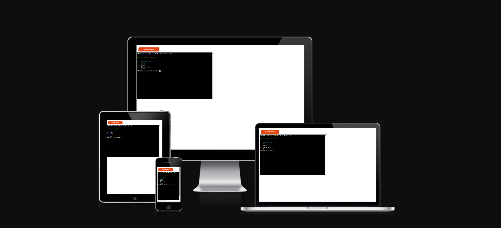

# Fandom Challenge V2

## Project Overview

Fandom Challenge V2 is a Python terminal-based quiz game that runs in the Code Institute mock terminal on Heroku. Players can test their knowledge of different gaming franchises (Jak and Daxter, Ratchet & Clank, and God of War) through multiple-choice questions.

Players begin by selecting a category, after which the program randomly generates a set of questions, ensuring variety and replayability with each playthrough. Answer options are also shuffled every round to prevent predictability. The game tracks player performance, validates input to handle errors gracefully, and rewards high-scoring players with a special celebratory ASCII message.

This project demonstrates core Python programming concepts such as loops, conditionals, functions, lists, dictionaries, randomisation and user input validation. It also showcases the ability to build an interactive terminal application that balances fun gameplay with reliable, well-structured code.

## User Goals

- Enjoy a fun and engaging terminal-based quiz experience.
- Test knowledge of multiple gaming franchises.
- Understand the quiz rules before playing.
- Play from any device that can run a Python terminal.
- Receive instant feedback on answers.
- Answer options are randomised each time to ensure true knowledge is tested.
- Replay quizzes for better results and enhanced replayability.

## User Stories

1. As a new player, I want to run the quiz easily from the terminal.
2. As a player, I want the quiz to randomise questions so each game feels fresh.
3. As a player, I want answer options to appear in different orders to prevent memorisation.
4. As a player, I want immediate feedback after answering so I know if I was correct or incorrect.
5. As a player, I want to see my final score and high scores at the end.
6. As a player, I want different outcomes depending on my performance.
7. As a returning player, I want my high scores to persist between sessions for long-term progress.
8. As a player, I want to be able to replay the quiz without restarting the program.

## Website Goals and Objectives

- Build an interactive, terminal-based quiz game that is fun and engaging for fans of popular gaming franchises.
- Provide a simple, text-based interface that is easy to understand and navigate.
- Allow players to select a category and receive a randomised set of questions for variety and replayability.
- Shuffle answer options for each question to prevent predictability and keep the quiz challenging.
- Validate user input to handle errors gracefully and maintain a smooth game flow.
- Track and display player scores, rewarding high performers with a special celebratory ASCII message.
- Write clean, well-structured Python code that demonstrates key programming concepts such as loops, functions, lists, dictionaries, and conditionals.
- Ensure the game runs reliably in the Code Institute mock terminal on Heroku, providing consistent performance.
- Use version control (Git/GitHub) for development, tracking progress and enabling easy maintenance.
- Test thoroughly to confirm that question randomisation, input validation, scoring, and ASCII feedback all function as expected.

## Design Choices

### Typography & Display

As this project runs entirely in a Python terminal, there is no traditional web typography or UI. Instead, design choices focus on readability, clarity, and creating a visually engaging experience through text alone.  

To enhance the presentation, the project uses **ASCII art** at key moments, such as the celebratory message for high-scoring players. This adds personality, variety, and a “retro terminal game” feel.  

### Colour Scheme

To create a more dynamic and immersive terminal experience, the project makes use of the **Colorama** library. This enables coloured text output in the terminal, helping to:

- **Differentiate categories** by displaying them in distinct colours.
- **Highlight correct and incorrect answers** with green and red for instant feedback.
- **Draw attention to the score and celebratory messages** with bright, contrasting colours.
- **Break up blocks of plain text** and make the interface more engaging to read.

The choice of colours was guided by readability and accessibility within a terminal environment. Bright colours are used sparingly for emphasis, while most text remains in neutral tones to avoid overwhelming the player.

### Atmosphere

Together, the combination of ASCII art and Colorama colours provides a strong sense of atmosphere. Despite the limitations of a text-only interface, these design elements help transform the quiz from a plain terminal application into a more **interactive, fun, and fandom-themed experience**.

*Note: Unlike a web-based project, this design did not rely on a strict predefined palette or typography system. Instead, colour choices and ASCII styling evolved naturally during development, guided by readability and player experience.*

## How to Play

Fandom Challenge V2 is a multiple-choice quiz game based on popular gaming franchises.

1. When the game starts, the player is asked to **choose a category** from the available options (Jak and Daxter, Ratchet & Clank, or God of War).
2. The program then **randomly selects a set of questions** from the chosen category to create a unique quiz each round.
3. For each question, **four possible answers** (A-D) are displayed. The answer order is shuffled every time to prevent predictability and player memorisation from previous attempts.
4. The player types the letter (**A, B, C, or D**) that corresponds to their chosen answer.
   - If they get the answer right, the player recieves a "Correct!" message highlighted in **green**.
   - If they get the answer incorrect, the player recieves a "Wrong!" message shown in **red**, and the correct option is revealed.
5. The quiz continues until all ten selected questions have been answered.
6. At the end, the player receives their **final score out of 10**.
   - If the player scores **9 or above**, they are rewarded with a celebratory **ASCII art message**.

This simple but engaging gameplay loop makes the quiz fun, replayable and easy to understand.

## Features

- Choose from multiple quiz categories (Jak and Daxter, Ratchet & Clank, God of War).
- Randomised questions within each quiz.
- Color-coded feedback for correct and incorrect answers.
- Score tracking and end-of-quiz results.
- Replay option to try again.

### Existing Features

#### Main Menu
- When the program launches, users are greeted with the **main menu**, offering four options:
  1. **Rules:** Explains how the quiz works.
  2. **About:** Displays information about the project.
  3. **Start Quiz:** Opens the quiz selection menu.
  4. **Exit:** Ends the program.
- The menu uses **Colorama colours** to improve readability and guide the user’s choices.

#### Rules Screen
- Clearly outlines the rules of the quiz:
  - Multiple-choice format (A-D).
  - One correct answer per question.
  - Score shown at the end.
- Keeps users informed before they begin.

### About Screen
- Displays background information about the project and its fandom theme.
- Explains the inspiration and purpose of the quiz.
- Provides a short, engaging break from the gameplay.

### Quiz Selection
- Users can choose from three fandom categories:
  - **Jak and Daxter**
  - **Ratchet & Clank**
  - **God of War**
- Each category loads a randomised quiz of **10 questions**.
- Users can also return to the main menu at any time.

### Gameplay (Quiz)
- Each quiz:
  - Displays a **question number (Q1-Q10)**.
  - Shuffles the multiple-choice answers so they appear in a different order each run.
  - Accepts answers (A–D) in a case-insensitive format.
- Features:
  - **Correct answers** are displayed in green.
  - **Incorrect answers** are shown in red, with the correct answer revealed.
- Prevents crashes by validating input: if the user enters something invalid, the game warns them and skips the question.

### Scoring & Feedback
- At the end of each quiz, the program shows the **final score out of 10**.
- Feedback is tailored based on performance:
  - **Under 7**: "You can do better. Try again."
  - **7 or 8**: "Good job! You know your stuff."
  - **9 or above**: "Congratulations! You're a superfan!"
- High-performing players also see **ASCII art celebratory graphics**, adding extra atmosphere.

### Colour Feedback
- Thanks to the **Colorama** library:
  - Menus are cyan for easy navigation.
  - Correct answers display in green.
  - Wrong answers display in red.
  - Final messages use yellow, green, or magenta depending on score.
- Colours improve clarity and help break up text in the terminal.

### Exit Screen
- Selecting “Exit” closes the program safely with a **friendly farewell message**.
- Uses yellow text to clearly signal that the game has ended.

## Future Enhancements

Planned improvements include:

- Adding more quiz categories and questions.
- Implementing a timer for each question.
- Adding ASCII art or simple terminal graphics for visual engagement.
- Integrating keyboard shortcuts for faster input.
- Implementing leaderboard features (including user initials, top 10 scores and completion times).

## Technologies Used

- **Python 3:** Core programming language.
- **Colorama:** For colored terminal output.
- **Heroku:** Deployment platform.
- **GitHub:** Version control and source code hosting.

## Data Model

The quiz is structured around simple Python data types, making the logic clear and easy to extend:

- **Questions and Answers:**
  Each quiz question is stored in a **dictionary** containing the question text, a list of possible answers, and the correct answer. These dictionaries are grouped into lists by category (Jak and Daxter, Ratchet & Clank, God of War).

- **Randomisation:**
  The `random` module is used to shuffle both the **questions** and the **answer order** each round. This ensures replayability and prevents players from memorising answer positions.

- **User Input and Validation:**
  Player choices are mapped to a dictionary of options (`A-D`) so input can be validated consistently. Invalid entries trigger error handling that prompts the user to try again instead of breaking the program.

- **Score Tracking:**
  The player’s score is tracked with a simple integer counter that increments whenever a correct answer is given. At the end of the quiz, this score is compared against thresholds to determine the final message (including the ASCII “superfan” celebration for high scores).

This lightweight model was chosen deliberately: it avoids unnecessary complexity, keeps the code readable, and allows new categories or questions to be added easily in the future.

## Testing

Testing included:

- Manual testing of input handling and score calculation.
- Verifying randomisation of questions and answer order.
- Deployment testing on Heroku terminal.
- Error handling for invalid input or empty answers.

### Bug Testing Log

**Quiz Display Issues:**
- **Bug:** Quiz displayed all questions instead of 10 random.
  - **Observed Behavior:** All questions in the dataset appeared each time a quiz was played.
  - **Cause:** `for` loop iterated over `questions` instead of `selected_questions`.
  - **Resolution:** Changed the loop to `for i, q in enumerate(selected_questions, start=1)`.

**Answer Recognition Bugs:**
- **Bug:** Player answers always marked wrong.
  - **Observed Behavior:** Correct answers were not recognized; even valid choices returned "Wrong!".
  - **Cause:** Original code compared full option strings including old A/B/C/D prefixes.
  - **Resolution:** Stripped original letter prefix using `clean_options = [opt[3:].strip() ...]` and shuffled these clean options.

- **Bug:** Invalid choice error for valid input.
  - **Observed Behavior:** Input like 'A', 'B', etc., sometimes triggered "Invalid choice. Skipping question.".
  - **Cause:** Options were shuffled but mapping to labels was inconsistent.
  - **Resolution:** Added `option_mapping` dictionary mapping new labels A-D to shuffled options and checked input against this mapping.

**Superfan Message Bug:**
- **Bug:** Superfan ASCII displayed even for low scores.
  - **Observed Behavior:** Even scoring 5/10 triggered the superfan message.
  - **Cause:** ASCII print was outside the score check `else` block.
  - **Resolution:** Moved the ASCII celebration inside the `else` block that only executes for `score >= 9`.

**Score/Variable Errors:**
- **Bug:** `NameError: name 'score' is not defined`.
  - **Observed Behavior:** Crash when trying to print final score.
  - **Cause:** Some print statements were accidentally placed outside `play_quiz()` function.
  - **Resolution:** Ensured all `score` references are within the function scope and correctly indented.

**Indentation Issues:**
- **Bug:** Indentation errors.
  - **Observed Behavior:** `IndentationError: expected an indented block`.
  - **Cause:** Some blocks (loops, if/else) were not properly indented after major rewriting.
  - **Resolution:** Fixed all indentation consistently: 4 spaces per level, nested blocks 8+ spaces.

## Deployment

This project was deployed using Heroku:

1. Fork or clone this repository.
2. Create a new Heroku app.
3. In the **Settings** tab, add the following buildpacks in order:
   - `heroku/python`
   - `heroku/nodejs`
4. Set a config var:
   - `PORT` = `8000`
5. Connect the Heroku app to your GitHub repository.
6. Deploy the main branch manually, or enable automatic deploys.

The live deployed app can be found here:  
[Fandom Challenge V2 on Heroku](https://fandom-challenge-v2-a2c443c8af3e.herokuapp.com/)

## Credits

I would like to thank the following people and resources for their support and guidance throughout this project:

- **Tim (mentor):** For his valuable feedback, encouragement, and guidance throughout development. We had three scheduled calls: at project inception, midway through development and at project completion. He advised me to do a quiz for this project and to avoid grid systems to keep things simple. He also taught me about the importance of keeping the user in a loop until they enter a valid response to ensure that the project won't break.

- **Code Institute:** for the deployment template.

- **Code Institute LMS:** For teaching me Python, and web design principles through detailed walkthroughs and exercises.

- **Code Institute sample README.md for Project 3:** Used as inspiration for structuring the **How to Play** and **Data Model** sections in this README.

[Code Institute sample README.md for Project 3](https://learn.codeinstitute.net/courses/course-v1:CodeInstitute+PE_PAGPPF+2021_Q2/courseware/b3378fc1159e43e3b70916fdefdfae51/605f34e006594dc4ae19f5e60ec75e2e/)

- **ChatGPT:** Assisted in brainstorming initial draft questions for `data.py`. All questions and answers were reviewed, verified, and corrected manually to ensure accuracy with canonical sources.

- **Markdown learning resources:**  
  - [Markdown Tutorial Video](https://www.youtube.com/watch?v=HUBNt18RFbo)  
  - [Markdown Live Preview](https://markdownlivepreview.com/)

  - Developed by LouisCE for Code Institute Portfolio Project 3.

Thank you all for your help and guidance.