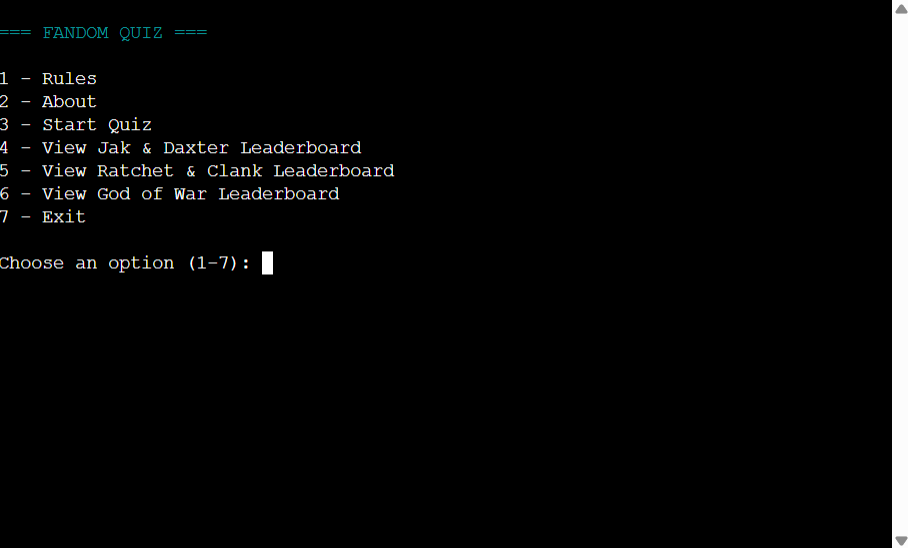
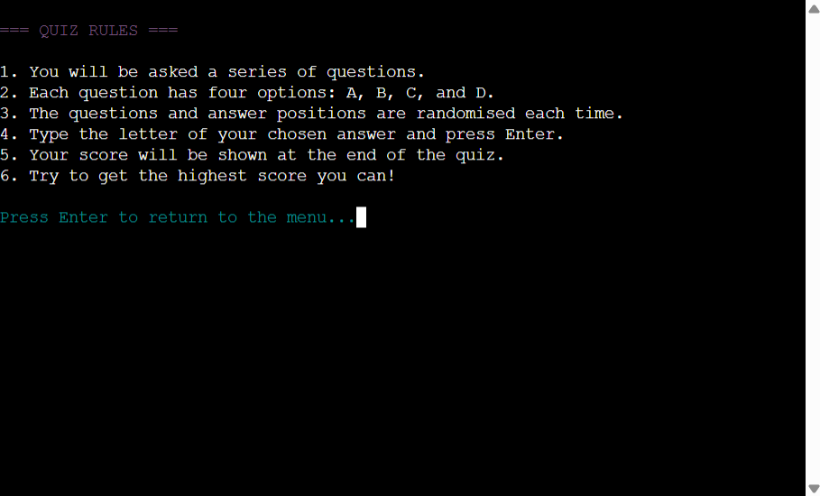
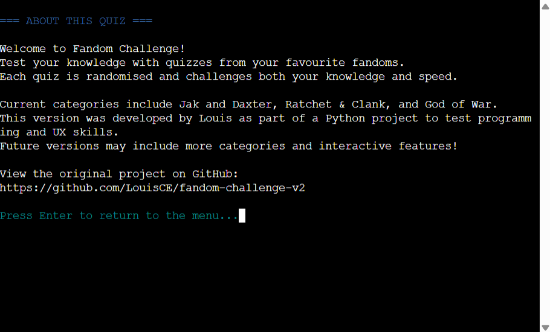
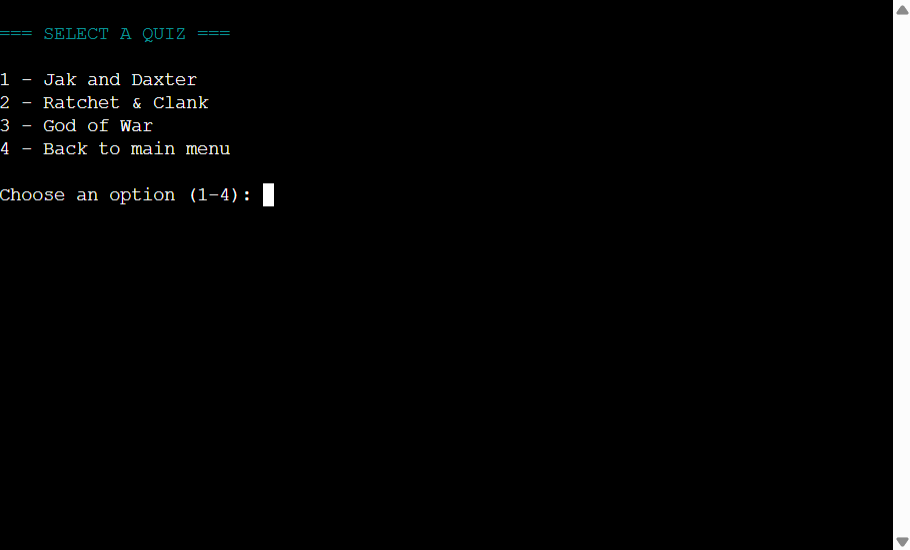
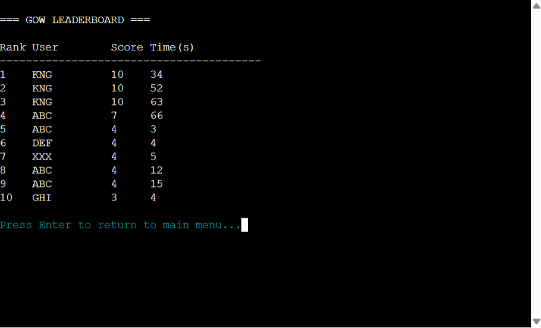
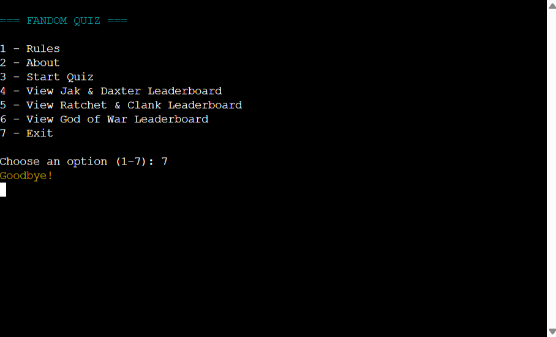

# Fandom Challenge V2

## Project Overview

Fandom Challenge V2 is a Python terminal-based quiz game that runs in the Code Institute mock terminal on Heroku. Players can test their knowledge of different gaming franchises (Jak and Daxter, Ratchet & Clank, and God of War) through multiple-choice questions.

Players begin by selecting a category, after which the program randomly generates a set of questions, ensuring variety and replayability with each playthrough. Answer options are also shuffled every round to prevent predictability. The game tracks player performance, validates input to handle errors gracefully, and rewards high-scoring players with a special celebratory ASCII message.

This project demonstrates core Python programming concepts such as loops, conditionals, functions, lists, dictionaries, randomisation and user input validation. It also showcases the ability to build an interactive terminal application that balances fun gameplay with reliable, well-structured code.


## User Goals

- Enjoy a fun and engaging terminal-based quiz experience.
- Test knowledge of multiple gaming franchises.
- Understand the quiz rules before playing.
- Play from any device that can run a Python terminal.
- Receive instant feedback on answers.
- Answer options are randomised each time to ensure true knowledge is tested.
- Replay quizzes for better results and enhanced replayability.

## User Stories

| Target | Expectation | Outcome |
| --- | --- | --- |
| As a new player | I want there to be a 'Rules' section | so that I can learn how to play and begin without confusion. |
| As a player | I want there to be an 'About' section | so that I can learn more about the quiz and its purpose. |
| As a player | I want freedom to choose between multiple different quizzes. | so that I can test my knowledge on multiple different fandoms. |
| As a player | I want the quiz to randomise questions each game | so that every playthrough feels fresh and not repetitive. |
| As a player | I want answer options to appear in different orders | so that I can’t rely on memorisation to get answers right. |
| As a player | I want immediate feedback after answering | so that I know if I was correct or incorrect right away as well as what the right answer is. |
| As a player | I want to see my final score at the end | so that I can measure my performance for that session. |
| As a player | I want different outcomes depending on my score | so that the game feels more rewarding and dynamic. |
| As a player | I want to be able to play another quiz without restarting the program | so that I can quickly try again if I want to improve. |
| As a player | I want a timer to run in the background | so that I feel more challenge and urgency while answering. |
| As a player | I want the timer to affect leaderboard rankings | so that the game rewards quick thinking in addition to accuracy. |
| As a competitive player | I want to see a persistent leaderboard of high scores | so that I can compare my results with others or past runs. |

## Website Goals and Objectives

- Build an interactive, terminal-based quiz game that is fun and engaging for fans of popular gaming franchises.
- Provide a simple, text-based interface that is easy to understand and navigate.
- Allow players to select a category and receive a randomised set of questions for variety and replayability.
- Shuffle answer options for each question to prevent predictability and keep the quiz challenging.
- Validate user input to handle errors gracefully and maintain a smooth game flow.
- Track and display player scores, rewarding high performers with a special celebratory ASCII message.
- Write clean, well-structured Python code that demonstrates key programming concepts such as loops, functions, lists, dictionaries, and conditionals.
- Ensure the game runs reliably in the Code Institute mock terminal on Heroku, providing consistent performance.
- Use version control (Git/GitHub) for development, tracking progress and enabling easy maintenance.
- Test thoroughly to confirm that question randomisation, input validation, scoring, and ASCII feedback all function as expected.

## Design Choices

### Typography & Display

As this project runs entirely in a Python terminal, there is no traditional web typography or UI. Instead, design choices focus on readability, clarity, and creating a visually engaging experience through text alone.  

To enhance the presentation, the project uses **ASCII art** at key moments, such as the celebratory message for high-scoring players. This adds personality, variety, and a “retro terminal game” feel.  

### Colour Scheme

To create a more dynamic and immersive terminal experience, the project makes use of the **Colorama** library. This enables coloured text output in the terminal, helping to:

- **Differentiate categories** by displaying them in distinct colours.
- **Highlight correct and incorrect answers** with green and red for instant feedback.
- **Draw attention to the score and celebratory messages** with bright, contrasting colours.
- **Break up blocks of plain text** and make the interface more engaging to read.

The choice of colours was guided by readability and accessibility within a terminal environment. Bright colours are used sparingly for emphasis, while most text remains in neutral tones to avoid overwhelming the player.

### Atmosphere

Together, the combination of ASCII art and Colorama colours provides a strong sense of atmosphere. Despite the limitations of a text-only interface, these design elements help transform the quiz from a plain terminal application into a more **interactive, fun, and fandom-themed experience**.

*Note: Unlike a web-based project, this design did not rely on a strict predefined palette or typography system. Instead, colour choices and ASCII styling evolved naturally during development, guided by readability and player experience.*

## How to Play

Fandom Challenge V2 is a multiple-choice quiz game based on popular gaming franchises.

1. When the game starts, the player is asked to **choose a category** from the available options (Jak and Daxter, Ratchet & Clank, or God of War).
2. The program then **randomly selects a set of questions** from the chosen category to create a unique quiz each round.
3. For each question, **four possible answers** (A-D) are displayed. The answer order is shuffled every time to prevent predictability and player memorisation from previous attempts.
4. The player types the letter (**A, B, C, or D**) that corresponds to their chosen answer.
   - If they get the answer right, the player recieves a "Correct!" message highlighted in **green**.
   - If they get the answer incorrect, the player recieves a "Wrong!" message shown in **red**, and the correct option is revealed.
5. The quiz continues until all ten selected questions have been answered.
6. At the end, the player receives their **final score out of 10**.
   - If the player scores **9 or above**, they are rewarded with a celebratory **ASCII art message**.

This simple but engaging gameplay loop makes the quiz fun, replayable and easy to understand.

## Features

- Choose from multiple quiz categories (Jak and Daxter, Ratchet & Clank, God of War).
- Randomised questions within each quiz.
- Color-coded feedback for correct and incorrect answers.
- Score tracking and end-of-quiz results.
- Replay option to try again.

### Existing Features

#### Main Menu
- When the program launches, users are greeted with the **main menu**, offering four options:
  1. **Rules:** Explains how the quiz works.
  2. **About:** Displays information about the project.
  3. **Start Quiz:** Opens the quiz selection menu.
  4. **Exit:** Ends the program.
- The menu uses **Colorama colours** to improve readability and guide the user’s choices.



#### Rules Screen
- Clearly outlines the rules of the quiz:
  - Multiple-choice format (A-D).
  - One correct answer per question.
  - Score shown at the end.
- Keeps users informed before they begin.



#### About Screen
- Displays background information about the project and its fandom theme.
- Explains the inspiration and purpose of the quiz.
- Provides a short, engaging break from the gameplay.



#### Quiz Selection
- Users can choose from three fandom categories:
  - **Jak and Daxter**
  - **Ratchet & Clank**
  - **God of War**
- Each category loads a randomised quiz of **10 questions**.
- Users can also return to the main menu at any time.



#### Gameplay (Quiz)
- Each quiz:
  - Displays a **question number (Q1-Q10)**.
  - Shuffles the multiple-choice answers so they appear in a different order each run.
  - Accepts answers (A–D) in a case-insensitive format.
- Features:
  - **Correct answers** are displayed in green.
  - **Incorrect answers** are shown in red, with the correct answer revealed.
- Prevents crashes by validating input: if the user enters something invalid, the game warns them and tells them to enter something valid.


#### Scoring & Feedback
- At the end of each quiz, the program shows the **final score out of 10**.
- Feedback is tailored based on performance:
  - **Under 7**: "You can do better. Try again."
  - **7 or 8**: "Good job! You know your stuff."
  - **9 or above**: "Congratulations! You're a superfan!"
- High-performing players also see **ASCII art celebratory graphics**, adding extra atmosphere.


#### Leaderboard
- After completing a quiz, players can view the **leaderboard** showing the top ten scores.
- Features:
  - Each quiz category (**Jak and Daxter**, **Ratchet & Clank**, **God of War**) has its **own dedicated leaderboard**.
  - Stores and displays the **highest scores across sessions** for that category.
  - Updates automatically when a new high score is achieved.
  - A **timer** runs in the background, adding urgency and challenge.
  - **Leaderboard ranking rules**:
    - Score takes priority in the rankings. Higher scores get higher rankings.
    - In the event of equal scores, faster completion times are ranked higher, acting as a tiebreaker.
  - Encourages replayability by letting players compete with themselves and others for the fastest and highest-scoring runs.
- Adds an extra layer of challenge and motivation beyond just completing the quiz.




#### Colour Feedback
- Thanks to the **Colorama** library:
  - Menus are cyan for easy navigation.
  - Correct answers display in green.
  - Wrong answers display in red.
  - Final messages use yellow, green, or magenta depending on score.
- Colours improve clarity and help break up text in the terminal.


#### Exit Screen
- Selecting “Exit” closes the program safely with a **friendly farewell message**.
- Uses yellow text to clearly signal that the game has ended.



## Future Enhancements

Planned improvements include:

- Adding more quiz categories and questions.
- Implementing a timer for each question.
- Adding ASCII art or simple terminal graphics for visual engagement.
- Integrating keyboard shortcuts for faster input.

## Tools & Technologies Used

| Tool / Tech | Use |
| --- | --- |
| [](https://git-scm.com) | Version control. (`git add`, `git commit`, `git push`) |
| [](https://github.com) | Secure online code storage. |
| [](https://code.visualstudio.com) | Local IDE for development. |
| [](https://www.python.org) | Back-end programming language. |
|  | Python library for coloured terminal output. |
| [](https://www.heroku.com) | Hosting the deployed back-end site. |
| [](https://docs.google.com/spreadsheets) | Storing data from my Python app. |
| [](https://chat.openai.com) | Help generating quiz questions and answer options. |
| [](https://www.lucidchart.com) | Flow diagrams for mapping the app's logic. |
| [](https://mermaid.live) | Generate an interactive diagram for the data/schema. |

## Database Design

### Data Model

The quiz is structured around simple Python data types, making the logic clear and easy to extend:

- **Questions and Answers:**
  Each quiz question is stored in a **dictionary** containing the question text, a list of possible answers, and the correct answer. These dictionaries are grouped into lists by category (Jak and Daxter, Ratchet & Clank, God of War).

- **Randomisation:**
  The `random` module is used to shuffle both the **questions** and the **answer order** each round. This ensures replayability and prevents players from memorising answer positions.

- **User Input and Validation:**
  Player choices are mapped to a dictionary of options (`A-D`) so input can be validated consistently. Invalid entries trigger error handling that prompts the user to try again instead of breaking the program.

- **Score Tracking:**
  The player’s score is tracked with a simple integer counter that increments whenever a correct answer is given. At the end of the quiz, this score is compared against thresholds to determine the final message (including the ASCII “superfan” celebration for high scores).

#### Flowchart (Lucidchart)

This lightweight model was chosen deliberately: it avoids unnecessary complexity, keeps the code readable, and allows new categories or questions to be added easily in the future.

To follow best practice, a flowchart was created to showcase the progression of my Python app.  
I've used [Lucidchart](https://www.lucidchart.com/pages/examples/flowchart-maker) to design my app flowchart.

The diagram provides a **high-level overview** of the program logic.  
It focuses on the main user journey (menu navigation, quiz gameplay, and leaderboard flow) rather than every small detail, in order to keep the structure clear and easy to follow.


#### Flowchart (Mermaid)

To plan out the logic of the Fandom Challenge V2 quiz, a flowchart was created to show the main cycle of the application. It covers everything from starting the quiz, selecting a category, answering questions, and finally saving results to the leaderboard.

The flowchart was designed directly in Markdown using the [Mermaid](https://mermaid.live) library. Mermaid has the advantage of being lightweight and interactive in GitHub, so the diagram can be viewed directly inside the README without requiring a separate image file.


For maximum compatibility, a static screenshot of the flowchart is also provided below. This ensures that the diagram can be viewed correctly in environments where Mermaid is not supported.


#### Classes & Functions

This project is written in a **modular, function-based style**. Instead of using Python classes, the application is built with a series of reusable functions that handle the core quiz logic, menu navigation, leaderboard integration, and Google Sheets communication.

The primary functions in this application are:

- `menu()`
  - Displays the main menu and directs the user to Rules, About, or Quiz selection.
- `rules()`
  - Outputs the quiz rules in the terminal.
- `about()`
  - Displays information about the project and its purpose.
- `select_quiz()`
  - Provides a sub-menu for choosing between the different fandom quizzes.
- `play_quiz(questions, quiz_name)`
  - Runs the full quiz loop: selecting random questions, shuffling answers, validating input, checking answers, and recording results.
- `save_score(username, score, quiz_name, time_taken)`
  - Appends the player’s result to the relevant Google Sheets leaderboard worksheet.
- `display_leaderboard(quiz_name, top_n=10)`
  - Fetches, sorts, and displays the leaderboard for a chosen quiz.
- Helper logic (e.g., `safe_int`)
  - Ensures robust handling of unexpected input when working with Google Sheets records.

#### Imports

This project uses a combination of standard Python modules, third-party packages, and local imports to provide quiz functionality, leaderboard management, and enhanced terminal output.

**Standard Library Imports**
- `sys`: provides system-specific functions, used to exit the program cleanly.
- `os`: accesses environment variables for credentials and handles file operations.
- `json`: loads Google Sheets credentials stored in JSON format.
- `random`: selects random quiz questions and shuffles answer choices.
- `re`: validates user input using regular expressions.
- `datetime`: tracks the time taken to complete a quiz.

**Third-Party Imports**
- `colorama`: adds coloured console output to improve the user interface.
- `gspread`: connects with the Google Sheets API to save and retrieve leaderboard data.
- `google.oauth2.service_account`: authenticates with Google Sheets using service account credentials.

**Local Imports**
- `data`: contains quiz question sets (`JAK_QUESTIONS`, `RATCHET_QUESTIONS`, `GOD_OF_WAR_QUESTIONS`) stored externally for organisation and readability.

These imports support the main features of the project, including:
- Menu navigation (`menu`, `rules`, `about`, `select_quiz`, `play_quiz`).
- Quiz gameplay with randomised questions and shuffled answers.
- Leaderboard saving and retrieval using Google Sheets.
- Coloured terminal output for an improved user experience.

## Agile Development Process

This project was developed using Agile methodologies to ensure structured progress, clear tracking of tasks, and iterative improvement.

### GitHub Projects

[GitHub Projects](https://github.com/LouisCE/fandom-challenge-v2/projects) served as an Agile tool for this project.  
Through GitHub Projects, Epics, User Stories, Issues and Milestone tasks were planned, implemented, and tracked on a Kanban-style project board. This allowed for organised task flow and progress tracking throughout development.


### GitHub Issues

[GitHub Issues](https://github.com/LouisCE/fandom-challenge-v2/issues) was used to document user stories and tasks.
Although Issues were mainly created towards the end of the project for documentation purposes rather than continuous tracking, they still provide a clear record of requirements and features.

| Link | Screenshot |
| --- | --- |
| [](https://github.com/LouisCE/fandom-challenge-v2/issues?q=is%3Aissue%20is%3Aopen%20-label%3Abug) |  |
| [](https://github.com/LouisCE/fandom-challenge-v2/issues?q=is%3Aissue%20is%3Aclosed%20-label%3Abug) |  |

### MoSCoW Prioritisation

To manage development priorities, the project applied the MoSCoW prioritisation technique to decompose Epics into User Stories and rank them by importance:

- **Must Have:** Essential features required for the project to be functional and pass assessment (4 stories).
- **Should Have:** Valuable features that add significant value but are not critical (4 stories).
- **Could Have:** Optional features with a smaller impact if omitted (4 stories).

This approach ensured focus on delivering core functionality first while allowing flexibility for enhancement.

## Testing

Testing included:

- Manual testing of input handling and score calculation.
- Verifying randomisation of questions and answer order.
- Deployment testing on Heroku terminal.
- Error handling for invalid input or empty answers.

## Code Validation

### Python

All Python files in this project were validated using the [CI Python Linter](https://pep8ci.herokuapp.com).

#### run.py
- **Result:** No errors found after fixes. Initially, `run.py` had multiple PEP8 issues including:
  - Lines exceeding maximum length (79 characters) (`E501`).
  - Missing blank lines before functions/classes (`E302`, `E305`).
  - Incorrect inline comment spacing (`E261`).
  - Trailing whitespace and incorrect blank lines (`W291`, `W293`).
- **Resolution:**
  - Broke long strings into multiple lines within parentheses.
  - Added required blank lines around functions and classes.
  - Fixed inline comment spacing and removed trailing whitespace.
- **Screenshot:**  


#### data.py
- **Result:** No errors found after fixes. Initially, `data.py` had multiple issues including:
  - Syntax/formatting problems (mismatched string concatenation, missing commas).
  - Lines exceeding PEP8 maximum length (79 characters) reported by Flake8.
- **Resolution:**
  - Corrected all syntax and formatting errors.
  - Wrapped or split long lines to comply with PEP8 line-length standards.
  - Re-validated with Flake8 and confirmed zero errors remain.
- **Screenshot:**  


#### test_gsheets.py
- **Purpose:** A helper script used during development to confirm successful connection and read/write access to the Google Sheets API.
- **Result:** Passed PEP8 validation with no issues.
- **Screenshot:**


#### Summary
- All Python files pass PEP8 validation.
- Long lines (`E501`) were corrected by breaking strings inside parentheses, ensuring readability and compliance.  
- No `# noqa` overrides were required.
- External libraries (e.g., `colorama`, `gspread`, `google-auth`) were not validated, as they are third-party packages.
- `test_gsheets.py` was a development-only helper script used to verify that Google Sheets authentication and read/write worked correctly. It is not imported or used by `run.py`, and does not form part of the deployed application.

## Lighthouse Audit

Lighthouse testing is not required for PP3 since this project runs in a Python terminal. However, I carried out audits on my deployed Heroku app in **Chrome’s Incognito Mode** to reduce extension interference and check for any significant issues.

As expected, mobile scores are slightly lower due to **external render-blocking resources** and **third-party cookies**, which are known limitations of the Code Institute mock terminal. Desktop results are higher and show no critical usability issues.

### Lighthouse (Mobile)

| Metric                     | Score / Value |
|-----------------------------|---------------|
| **Performance**             | 94            |
| **Accessibility**           | 95            |
| **Best Practices**          | 100            |
| **SEO**                     | 90            |
| First Contentful Paint      | 2.5 s          |
| Largest Contentful Paint    | 2.5 s          |
| Total Blocking Time         | 0 ms         |
| Cumulative Layout Shift     | 0            |
| Speed Index                 | 2.5 s          |

*Note: Mobile scores are reduced due to third-party cookies and external render-blocking resources outside of my control.*


### Lighthouse (Desktop)

| Metric                     | Score / Value |
|-----------------------------|---------------|
| **Performance**             | 100            |
| **Accessibility**           | 95            |
| **Best Practices**          | 100            |
| **SEO**                     | 90            |
| First Contentful Paint      | 0.7 s          |
| Largest Contentful Paint    | 0.7 s          |
| Total Blocking Time         | 0 ms         |
| Cumulative Layout Shift     | 0            |
| Speed Index                 | 0.7 s          |


### Bug Testing Log

I have used manual logs to track bugs during development. Below is a log of the key bugs I fixed during the project:

**Quiz Display Issues:**
- **Bug:** Quiz displayed all questions instead of 10 random.
  - **Observed Behavior:** All questions in the dataset appeared each time a quiz was played.
  - **Cause:** `for` loop iterated over `questions` instead of `selected_questions`.
  - **Resolution:** Changed the loop to `for i, q in enumerate(selected_questions, start=1)`.

**Answer Recognition Bugs:**
- **Bug:** Player answers always marked wrong.
  - **Observed Behavior:** Correct answers were not recognized; even valid choices returned "Wrong!".
  - **Cause:** Original code compared full option strings including old A/B/C/D prefixes.
  - **Resolution:** Stripped original letter prefix using `clean_options = [opt[3:].strip() ...]` and shuffled these clean options.

- **Bug:** Invalid choice error for valid input.
  - **Observed Behavior:** Input like 'A', 'B', etc., sometimes triggered "Invalid choice. Skipping question.".
  - **Cause:** Options were shuffled but mapping to labels was inconsistent.
  - **Resolution:** Added `option_mapping` dictionary mapping new labels A-D to shuffled options and checked input against this mapping.

**Superfan Message Bug:**
- **Bug:** Superfan ASCII displayed even for low scores.
  - **Observed Behavior:** Even scoring 5/10 triggered the superfan message.
  - **Cause:** ASCII print was outside the score check `else` block.
  - **Resolution:** Moved the ASCII celebration inside the `else` block that only executes for `score >= 9`.

**Score/Variable Errors:**
- **Bug:** `NameError: name 'score' is not defined`.
  - **Observed Behavior:** Crash when trying to print final score.
  - **Cause:** Some print statements were accidentally placed outside `play_quiz()` function.
  - **Resolution:** Ensured all `score` references are within the function scope and correctly indented.

**Indentation Issues:**
- **Bug:** Indentation errors.
  - **Observed Behavior:** `IndentationError: expected an indented block`.
  - **Cause:** Some blocks (loops, if/else) were not properly indented after major rewriting.
  - **Resolution:** Fixed all indentation consistently: 4 spaces per level, nested blocks 8+ spaces.

## Defensive Programming

Defensive programming was carefully implemented and tested in the **Fandom Challenge V2** project to ensure the quiz handles invalid inputs gracefully and prevents errors or data corruption.

| Feature | Expectation | Test | Result | Screenshot |
| --- | --- | --- | --- | --- |
| Menu Navigation | User should only be able to select valid menu options (1–4). | Entered invalid options such as letters and numbers outside range. | Invalid input was caught, error message displayed, and menu reprinted. |  |
| Quiz Answer Input | User should only be able to enter A–D (or X to quit). | Entered lowercase letters, numbers, and special characters. | All invalid entries rejected with a clear error message; options reprinted. |  |
| Username Input | Usernames must be exactly 3 letters (A–Z). | Tested empty input, numbers, 2 letters, and 4 letters. | Invalid usernames rejected with explanation; valid 3-letter username accepted. |  |
| Leaderboard Save | Scores should only save if Google Sheets is available. | Simulated loss of connection to Google Sheets. | Program displayed error message without crashing; score not saved. |  |
| Randomisation | Questions and answer order should be different each game. | Played multiple quizzes in a row. | Verified that questions and option order were shuffled each time. |   |

### Summary
- **Invalid input handling:** Menus, answers, and usernames all reject invalid input until valid entries are provided.
- **Data integrity:** Scores only saved if the Google Sheets connection succeeds, with fallback to local play.
- **Randomisation:** Ensures fairness and prevents memorising answer positions.
- **User experience:** Helpful error messages guide players back on track without crashing the program.

### User Story Testing

All user stories were tested during development and confirmed to pass successfully.

| User Story | How It Was Addressed | Pass |
|------------|----------------------|------|
| As a new player, I want there to be a 'Rules' section so that I can learn how to play and begin without confusion. | `rules()` function displays clear step-by-step instructions before playing. | Yes |
| As a player, I want there to be an 'About' section so that I can learn more about the quiz and its purpose. | `about()` function provides project background, fandoms included, and a link to the repo. | Yes |
| As a player, I want freedom to choose between multiple different quizzes so that I can test my knowledge on multiple different fandoms. | Main menu allows choosing between Jak and Daxter, Ratchet & Clank, and God of War categories. | Yes |
| As a player, I want the quiz to randomise questions each game so that every playthrough feels fresh and not repetitive. | Question order is shuffled each run using Python’s `random` module. | Yes |
| As a player, I want answer options to appear in different orders so that I can’t rely on memorisation to get answers right. | Answer options are randomised before each question is displayed. | Yes |
| As a player, I want immediate feedback after answering so that I know if I was correct or incorrect right away as well as what the right answer is. | After each guess, program prints whether the answer was correct and even shows the correct answer if they got it wrong. | Yes |
| As a player, I want to see my final score at the end so that I can measure my performance for that session. | At the end of the quiz, total correct answers are displayed out of the total number of questions. | Yes |
| As a player, I want different outcomes depending on my score so that the game feels more rewarding and dynamic. | Score thresholds trigger different feedback messages, e.g., "Congratulations! You're a superfan!" for 9/10 or above. | Yes |
| As a player, I want to be able to play another quiz without restarting the program so that I can quickly try again if I want to improve. | Options loop back to quiz menu during and after a quiz, allowing the player to select another category or retry. | Yes |
| As a player, I want a timer to run in the background so that I feel more challenge and urgency while answering. | Completion time is tracked and recorded on the leaderboard, adding pressure and urgency to each question. | Yes |
| As a player, I want the timer to affect leaderboard rankings so that the game rewards quick thinking in addition to accuracy. | Leaderboard scores are calculated with correctness as the primary factor and time taken as a secondary tiebreaker. | Yes |
| As a competitive player, I want to see a persistent leaderboard of high scores so that I can compare my results with others or past runs. | Google Sheets integration stores and retrieves high scores across sessions. | Yes |

## Deployment

This project was developed using the [Code Institute Python Essentials Template](https://github.com/Code-Institute-Org/python-essentials-template), which provides a terminal view for Python applications in the browser.  
This improves accessibility by allowing users to run the project directly online without needing to install Python locally.

The live deployed site can be found here:  
[Fandom Challenge V2 on Heroku](https://fandom-challenge-v2-a2c443c8af3e.herokuapp.com)

### Heroku Deployment

This project is hosted on [Heroku](https://www.heroku.com), a cloud platform that runs applications directly from GitHub repositories.  
The live deployed app can be found here:  
[Fandom Challenge V2 on Heroku](https://fandom-challenge-v2-a2c443c8af3e.herokuapp.com/)

#### Steps to Deploy

1. **Create a new Heroku app**
   - From the Heroku dashboard, click **New > Create new app**.
   - Choose a unique name and select your closest region (EU or USA).

2. **Set Config Vars**
   - Go to **Settings > Reveal Config Vars** and add:
     - `PORT` = `8000`
     - `CREDS` = Paste the JSON content of your Google Cloud service account credentials.

3. **Add Buildpacks**
   - In **Settings > Buildpacks**, add the following in this order:
     - `heroku/python`
     - `heroku/nodejs` (required by the Code Institute template).
   - Make sure Python is listed first.

4. **Push Required Files**
   - Ensure the following are in your repository:
     - `requirements.txt` – lists Python dependencies.
     - `Procfile` – tells Heroku how to run the app (`worker: python run.py`).
     - `.python-version` – specifies the Python version (e.g., `3.12`).

5. **Connect to GitHub**
   - Under **Deploy > Deployment method**, select GitHub and connect your repository.

6. **Deploy**
   - Either enable **Automatic Deploys** (recommended) or deploy manually using:
     ```bash
     git push heroku main
     ```

#### Notes

- The `CREDS` config var replaces the local `quiz_creds.json` file.  
- Python must be listed **before** Node.js in the buildpacks.  
- The app uses the Code Institute template, which requires both Python and Node.js.

### Google Sheets API

This project uses [Google Sheets](https://docs.google.com/spreadsheets) as a lightweight cloud-based database to store and retrieve quiz leaderboard data.

Each quiz has its own dedicated worksheet inside the main Google Sheet named `fandom-challenge-v2-data`. For example:
- `jak_leaderboard`
- `ratchet_leaderboard`
- `gow_leaderboard`

When a player finishes a quiz, their username, score, and time taken are appended to the relevant leaderboard sheet. The leaderboards are then read back, sorted, and displayed directly in the terminal.

#### Credentials Setup

To connect your own copy of this project to Google Sheets, you will need API credentials in `.JSON` format from the [Google Cloud Platform](https://console.cloud.google.com).

1. From the dashboard, click on **Select a project**, then **NEW PROJECT**.
2. Give the project a name, then click **CREATE**.
3. Select the project to enter its dashboard.
4. From the left-hand menu, choose **APIs & Services** > **Library**.
5. Enable both:
   - **Google Drive API**
   - **Google Sheets API**
6. Navigate to **APIs & Services** > **Credentials**.
7. Click **Create Credentials** and select **Service Account**.
8. Assign a name, click **Create**, then under **Role** choose **Basic** > **Editor**.
9. Continue, then click **Done**.
10. Open the new service account → **Keys** → **Add Key** → **Create new key** → choose `JSON`.
11. Download the credentials file.
    - For local development: rename it `quiz_creds.json` and place it in your project root.
    - For deployment (e.g., Heroku): copy the contents into a Config Var named `CREDS`.
12. Open your Google Sheet (`fandom-challenge-v2-data`) and share it with the `client_email` from the `quiz_creds.json`, granting **Editor** access.
13. Ensure your `quiz_creds.json` file is added to `.gitignore` so it is not pushed to GitHub.

### Local Development

To run the project locally:

1. Clone or fork the repository.
2. Install the required dependencies:

   ```bash
   pip3 install -r requirements.txt
3. Add your quiz_creds.json file to the project root.
4. Run the program:
   python3 run.py

#### Cloning

You can clone this repository by following these steps:

1. Go to the [Fandom Challenge V2 GitHub repository](https://www.github.com/LouisCE/fandom-challenge-v2).
2. Locate and click on the green **Code** button near the top of the repository.
3. Choose your preferred method (HTTPS, SSH, or GitHub CLI) and copy the URL.
4. Open your IDE terminal or Git Bash.
5. Navigate to the directory where you want the clone to be created.
6. Run the following command (using HTTPS):

   ```bash
   git clone https://www.github.com/LouisCE/fandom-challenge-v2.git

7. Press Enter and a local copy will be created.

Alternatively, if using Gitpod, you can click below to create your own workspace using this repository.

[](https://gitpod.io/#https://www.github.com/LouisCE/fandom-challenge-v2)

Note: To use Gitpod, you’ll need the Gitpod [browser extension](https://www.gitpod.io/docs/configure/user-settings/browser-extension) installed.

#### Forking

By forking the GitHub repository, you create a copy of the original project in your own GitHub account. This allows you to make changes without affecting the original.

Steps to fork this project:

1. Log in to GitHub and go to the [Fandom Challenge V2 repository](https://www.github.com/LouisCE/fandom-challenge-v2).
2. At the top right of the page, click the **Fork** button.
3. A copy of the repository will now be available under your GitHub account, where you can make edits independently of the original.

### Local vs Deployment

There are no major functional differences between running the project locally and using the deployed Heroku app.
The only difference lies in **how Google Sheets credentials are handled**:

- **Local Development**
  - Requires a `quiz_creds.json` file in the project root.
  - This file contains the Google Cloud service account credentials in JSON format.
  - The `run.py` script loads credentials from this file when run locally.

- **Heroku Deployment**
  - Instead of a file, the same JSON is stored in the `CREDS` config var in Heroku’s environment settings.
  - The app reads this environment variable, parses it with `json.loads()`, and authenticates with Google Sheets.
  - No physical credentials file is needed in the deployed app.

Aside from this difference in credentials handling, both versions of the project work identically:
- The menu system runs the same.
- Quizzes are randomised in the same way.
- Scores are saved to the same Google Sheet leaderboards.

### Known Issues

| Issue | Screenshot |
| --- | --- |
| **Colorama rendering** — Colours (particularly the magenta/purple colour used for the questions) appear bolder when running locally in VS Code compared to the deployed Heroku terminal. This is a limitation of the Code Institute mock terminal and does not affect functionality. |  |
| **CTRL+C termination** — If a user presses `CTRL`+`C` in the terminal, the application stops immediately and an error message is displayed. This is expected behaviour for Python programs running in a terminal. |  |

These are minor display or environment-related issues tied to the Heroku/CI mock terminal. They do not affect quiz gameplay or functionality. After thorough testing, no critical bugs remain.

## Credits

I would like to thank the following people and resources for their support and guidance throughout this project:

- **Tim (mentor):** For his valuable feedback, encouragement, and guidance throughout development. We had three scheduled calls: at project inception, midway through development and at project completion. He advised me to do a quiz for this project and to avoid grid systems to keep things simple. He also taught me about the importance of keeping the user in a loop until they enter a valid response to ensure that the project won't break.

- **Code Institute:** for the deployment template.

- **Code Institute LMS:** For teaching me Python, and web design principles through detailed walkthroughs and exercises.

- **Code Institute sample README.md for Project 3:** Used as inspiration for structuring the **How to Play** and **Data Model** sections in this README.

[Code Institute sample README.md for Project 3](https://learn.codeinstitute.net/courses/course-v1:CodeInstitute+PE_PAGPPF+2021_Q2/courseware/b3378fc1159e43e3b70916fdefdfae51/605f34e006594dc4ae19f5e60ec75e2e/)

- **ChatGPT:** Assisted in brainstorming initial draft questions for `data.py`. All questions and answers were reviewed, verified, and corrected manually to ensure accuracy with canonical sources.

- **Markdown learning resources:**  
  - [Markdown Tutorial Video](https://www.youtube.com/watch?v=HUBNt18RFbo)  
  - [Markdown Live Preview](https://markdownlivepreview.com/)

  - Developed by LouisCE for Code Institute Portfolio Project 3.

Thank you all for your help and guidance.